# GOT MILK(50)

We're provided with a 32bit binary and a 32bit custom library which is needed by the binary for some reasons that we will figure out later in this writeup.

first of all lets try running the binary.

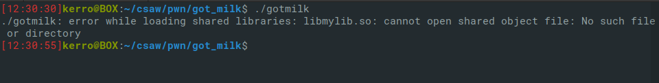

As you can see we got an error says that the library `libmylib.so` is not found we have to load it manually.

First let's verify that this library is needed by the binary using readelf .

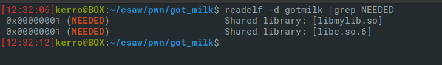

As you can see both `libc.so.6` and `libmylib.so` are needed by the binary we know that the first library exists already in linux in `/lib/i386-linux-gnu/` we can verify this by using ldd.

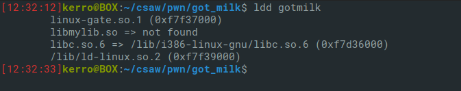

And the other library is not found my idea was if the binary found the `libc.so.6` so we have just to copy that provided library in the same path and it worked.

The binary is just asking for input after saying "No flag for you!" then it writes back our input with the same "No flag for you!" string . 

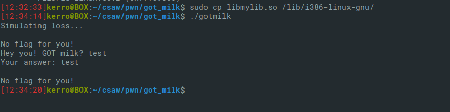

Nothing to note for now so let's open the binary in IDA it may help finding the bug.

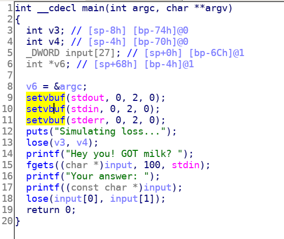

After decompiling the main function we clearly see a format string bug in line 17 it's printing our input without a format `%s` or whatever.

So let's build an attack scenario. It's calling `lose()` function twice once before asking for input and once after that.

Let's see what does this lose() function do exactly.
after we decompile it we see that it's an extern call and it should be defined in `libmylib.so`.

Let's open that library in IDA and decompile that function.

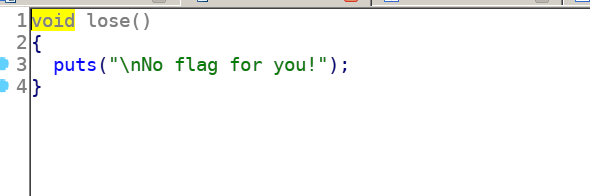

It just prints the string `No flag for you!` but after focusing on other functions defined in that library we can see a `win()` function.

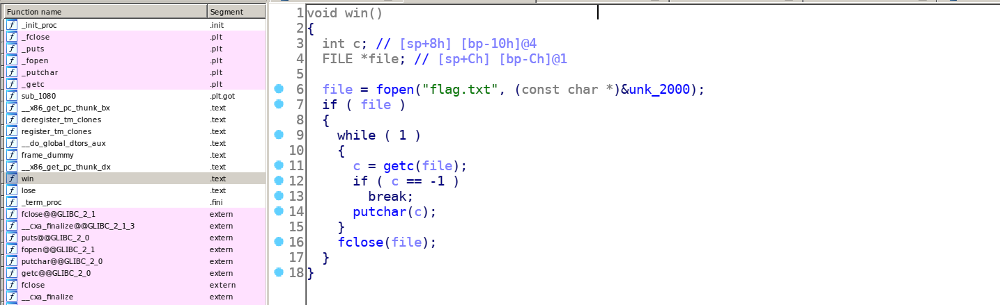

It opens the flag file and print its content.

So the attack scenario is clear now all we have to do is to overwrite the GOT (Global Offset Table) entry of lose() function in which the adress in libc of that function with the adress of win() function in libc to make the program jumps to win() instead of lose() in the second call at line 18 in the decompilation of main function (take a look at the picture again). 

But it has to be a ONE SHOT payload cuz we're allowed to give only one input to the program so we can't leak the whole adress and overwrite all of the GOT entry .

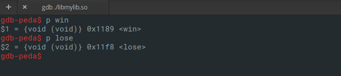

Using gdb we can know that the offset of win() function and lose() function in the library is almost the same just the last byte changed so we have to partially overwrite the GOT entry not all of it with the last byte of the offset (from `f8` to `89`).

The format string `%hhn` will help doing this (the Half of the Half of a WORD) which is one byte.

Now let's start by determining where our buffer is located in the stack.

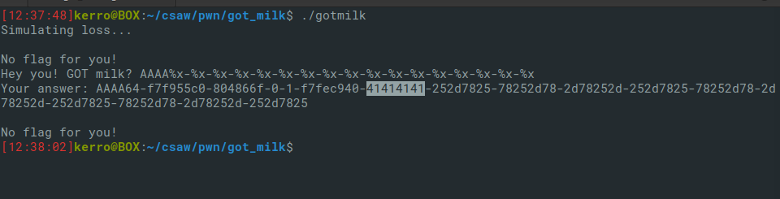

Counting from one we see that our buffer is the 7th in the stack we can use the `$` sign to make the `%n` goes and writes in the 7th location in the stack directly so it will become like `%7$hhn`

OKay now our payload is pretty simple just our got entry of the lose() function in little endian and we have to overrite the last byte with  `0x89 - 0x4` (the offset minus the number of bytes of the adress (4bytes) cuz %n writes the number of bytes already provided before it).

We can use objdump to get the GOT entry.

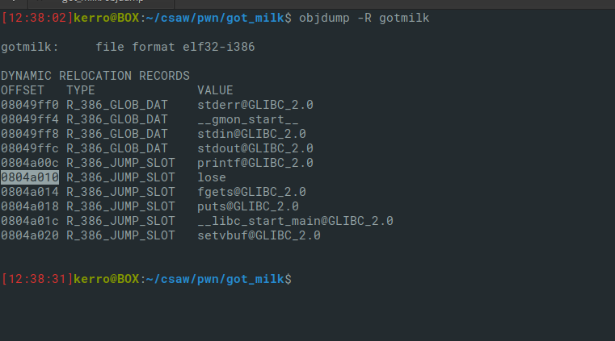

and here is our payload.

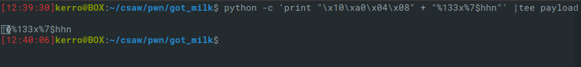

And here we are!

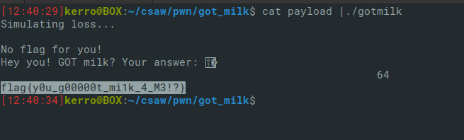

FLAG: `flag{y0u_g00000t_mi1k_4_M3!?}`
