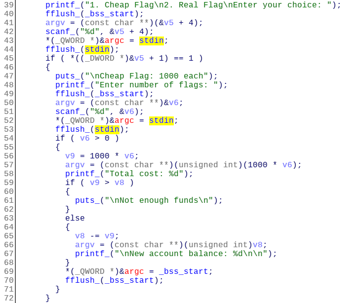
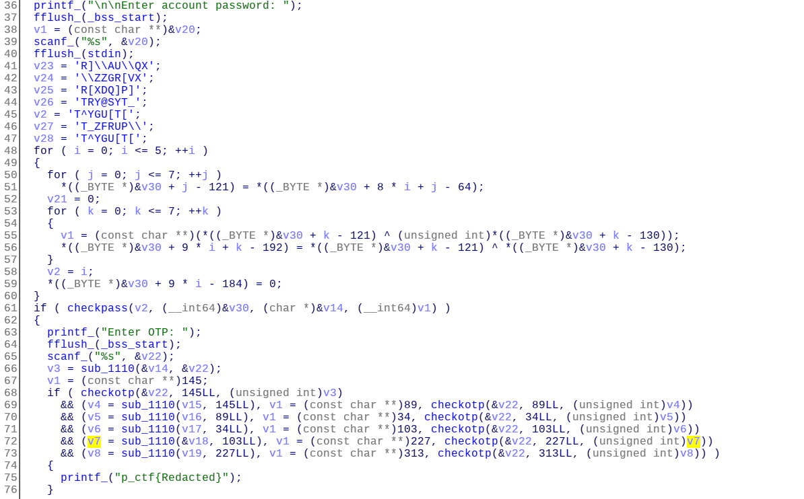
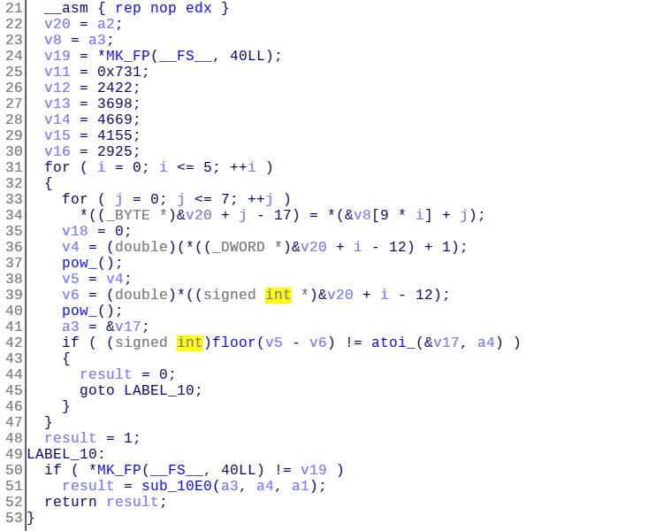
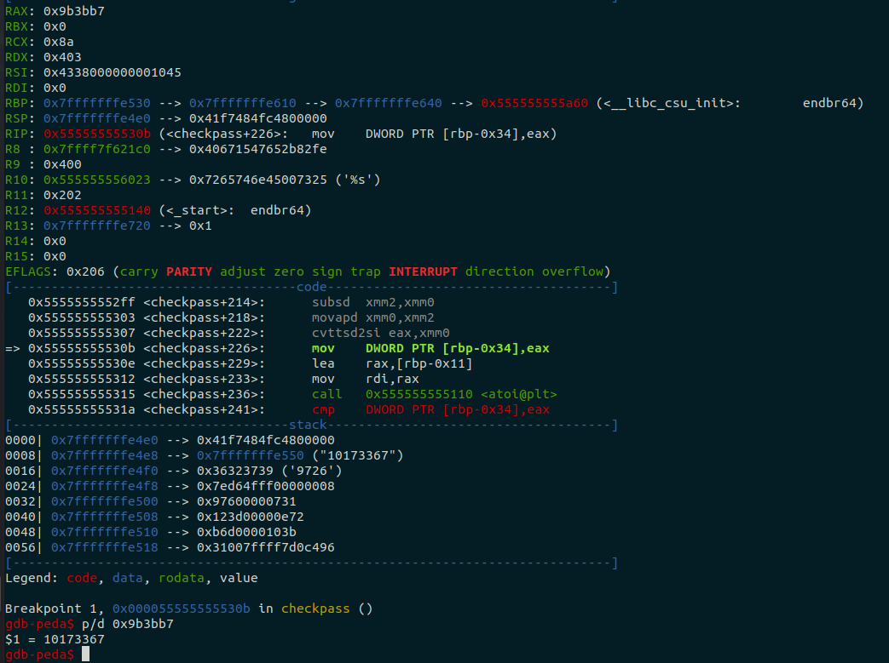
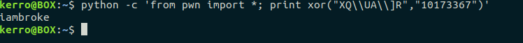
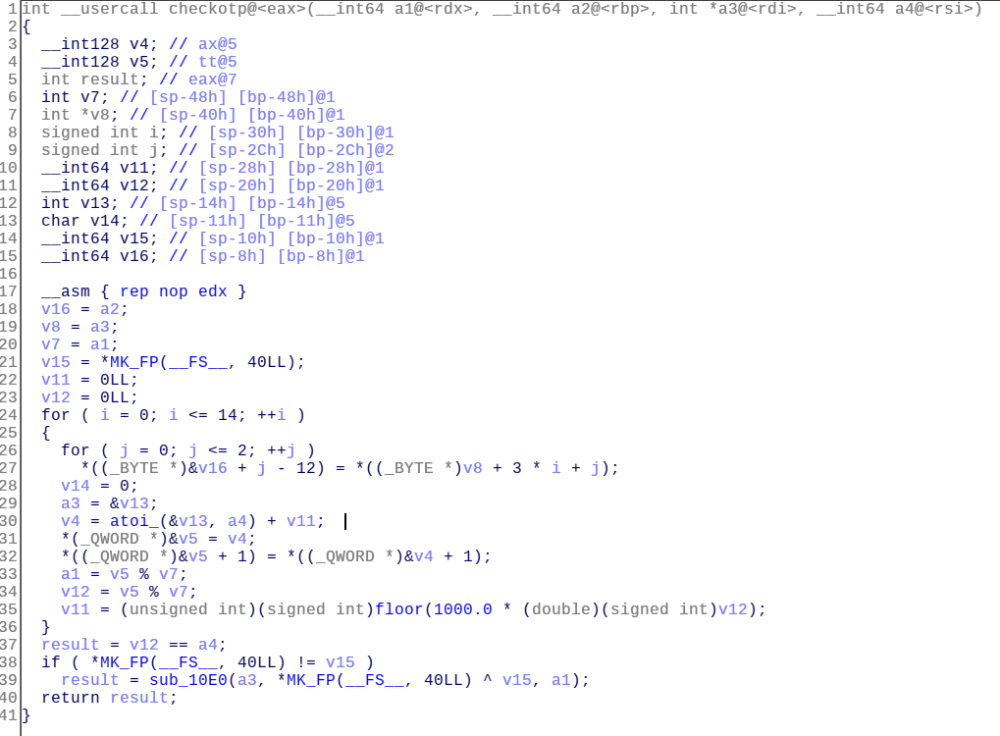
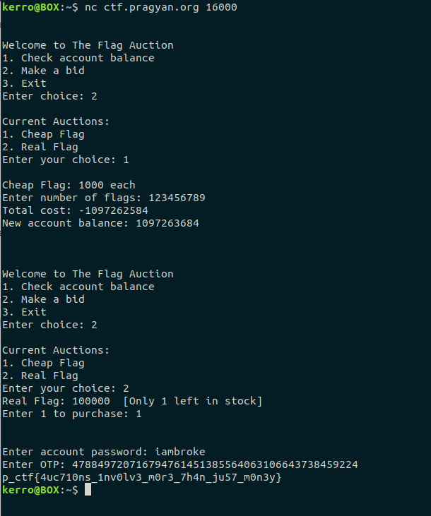

# Auction (250 pts)

We were given a 64 bit dynamically linked binary.

protections:

```
CANARY    : disabled
FORTIFY   : disabled
NX        : ENABLED
PIE       : disabled
RELRO     : disabled
```

Binary output:

```
Welcome to The Flag Auction
1. Check account balance
2. Make a bid
3. Exit
Enter choice: 
```

So we can choose between check account balance, bid or exit. In the bid option we can choose between a cheap flag or the real flag.

Initially we have 1100 balance and the real flag costs 100000 so we can only choose the cheap flag for now (costs 1000).

I loaded the binary in IDA pro. 



When we choose a cheap flag it asks for number of flags we wanna bid and stores the data in ```v6```. Then it calculates the total cost with the operation ```v9 = 1000 * v6``` (line 56).

Then it calculates the new account balance with substracting the old balance (in variable v8) from the total cost calculated before in v9 variable (line 65).

Both v6 and v9 are signed ints so if we give a very big number to scanf the result of the total cost will be negative.

Let's assume that to total cost is -123456

When it calculates the new balance value it will perform a ```v8 = v8 - (-123456)``` operation which is ```v8 = v8 + 123456```.

OKay, now using this integer overflow bug we have enough balance to bid for the real flag.

Now it comes the reversing part!

The binary is asking for account password in buy_flag function.



The first thing, the binary is copying the data from variable v23,v24,v25,v26,v2,v27,v27 (lines from 41 to 47) to another buffer.

Then it performs a xor operation between our input as a password and the content of each of these variables. They have the same length (8) so len(input)=8.

Then it calls the function ```checkpass``` with the xor result as an argument and test if it's return value is true it jumps the the OTP part. OKay let's find out what does the checkpass function do exactly.



It calculates some kind of exponents several times and each time compares the result to its following 8 bytes from the result of the previous xor as an integer.

So the program is expecting a numeric string from the xor operation.

I couldn't find out the calculations with the static analysis so i used a debugger (gdb in my case) to just dump the result.



So ```input xor "XQ\UA\]R"``` should be "10173367" as a string. (I got the "XQ\UA\]R" from the "buy_flag" function the content of variable v23)

Then we can find the right password with ``` "XQ\UA\]R" xor "10173367"```.



Account's password : ```iambroke```

Now, the binary is asking for an OTP.

then it calls ```checkotp``` function 6 times with our input and 2 integers as arguments and it tests for the return value of each call it must be true ( !=0 ).



This function is an implementation of MOD arithmetic operation in C language on big integers using strings as input.

Let's assume that the binary is performing checkotp(input,Ai,Bi) and "i" goes from 1 to 6 (6 times), each time this function tests if ```input % Ai == Bi```

The first thing came to my mind is the [Chinese remainder theorem](https://en.wikipedia.org/wiki/Chinese_remainder_theorem).

But to do that I need to dump all the Ai values and check if they are all pairwise coprime.

Values:

```
input % 10173367 == 145
input % 17605519 == 89
input % 41036707 == 34
input % 65412691 == 103
input % 51804541 == 227
input % 25675651 == 313
```

Then i wrote a simple python script to check if all the values (10173367, 17605519, 41036707,...) are pairwise coprime and got a positive result now we can apply the theorem to get the right input.

input: ```478849720716794761451385564063106643738459224```



