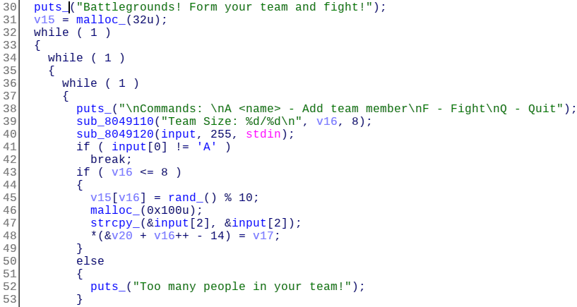

## Battle (150 pts)

We were given a 32bit dynamically linked binary.

protections:

```
CANARY    : disabled
FORTIFY   : disabled
NX        : disabled
PIE       : disabled
RELRO     : Partial
```
When we execute it, it gives this output:

```
Battlegrounds! Form your team and fight!

Commands: 
A <name> - Add team member
F - Fight
Q - Quit
Team Size: 0/8
```
We can add a team member with syntax ```A <name>``` or we can choose fight or quit.

Okay at this point we need to understand the exact behaviour so let's start with the static analysis.

I loaded the binary in IDA pro and start analyzing the add team member.



So it's testing on the number of team members we have 9 maximum (line 43). then it generates a score for each member randomly an integer between 0 and 9. and stores it in the array allocated in line 31.

Here i realized that we have an off by one bug, We can create up to 9 members and it allocated only an int[8].

We'll come back to this later but lets analyze the ```fight``` function first.


It calculates the sum of the scores of each team member and if it's equal to 400 it jumps to a ```win``` function.

We will use the off by one bug identified before to overwrite the array of the scores and put bytes there which its sum is 400.

then we will jump the the ```win``` function which is vulnerable to a stack based buffer overflow (it's performing a ```gets``` call). Then we will use the ret2libc technique to get a shell.
