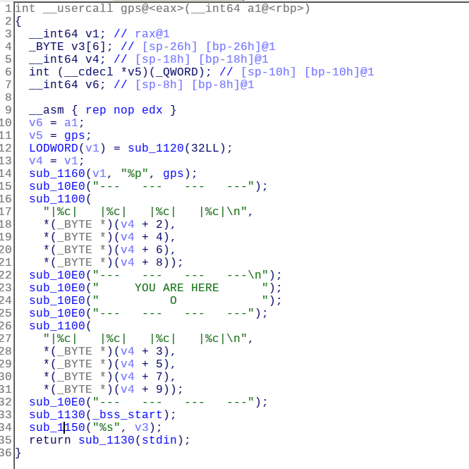

# Hide and seek (150 pts)

We were given a 64bit dynamically linked binary.

protections:

```
CANARY    : disabled
FORTIFY   : disabled
NX        : ENABLED
PIE       : ENABLED
RELRO     : FULL
```

After execution it gives this output:

```
---   ---   ---   ---
|5|   |5|   |b|   |d|
---   ---   ---   ---

     YOU ARE HERE      
          O            
---   ---   ---   ---
|5|   |9|   |7|   |0|
---   ---   ---   ---
```

I loaded it in IDA pro and the main function is calling a function named ```gps```. This function is printing the first 4 bytes of its pointer.



And we can clearly identify a buffer overflow vulnerability (line 34) it's calling scanf with "%s".

Also we can find a function named "found" it just prints the flag to stdout.

So the first approach is to brute force the missing byte of that function since we know its last byte from the offset. But for some reason it didn't work on the server and works locally tho...

The second approach is to use the same technique but this time we will calculate the addresses of ```puts in plt```, ```pop rdi ; ret``` and ```pop rsi ; pop r15 ; ret``` gadgets and the ```got entry``` for a function i used exit in my exploit.

Then we can leak exit's libc address in order to calculate the addresses of system and "/bin/sh" string and make a typical ret2libc exploit.
