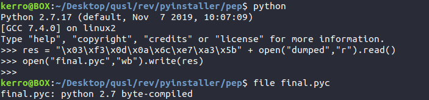

# CHANGE (944 pts)

We were given a zip archive file containing an 64bit binary and a bunch of libraries.

The binary is asking for a username and a password and prints ":(..." if they're wrong.


Seeing the libraries provided and by running strings on the binary itself we can figure out it's a python packed elf binary using pyInstaller. With a bit of googling we can learn that we can unpack the binary using pyi-archive_viewe.


Using that tool we can dump the file "task" and running strings against it too we'll notice some python functions like ```b64decode``` and ```base64encode```. So it's most likely a python compiled file but the header is missing we need just to append "\x03\xf3\x0d\x0a\x6c\xe7\xa3\x5b" in the beginning.



and then using uncompyle6 we get this code:

```python
from hashlib import md5
from base64 import b64decode
from base64 import b64encode
from Crypto.Cipher import AES
from Crypto.Random import get_random_bytes
import random

class cipher:
    __module__ = __name__

    def __init__(self, key):
        self.key = md5(key.encode('utf8')).digest()
        self.padd = 0

    def encrypt(self, data):
        iv = get_random_string('AAAAAAAAAAAAAAAA')
        self.cipher = AES.new(self.key, AES.MODE_CBC, iv)
        ta = self.cipher.encrypt(self.pad(data))
        return b64encode(iv + ta)

    def decrypt(self, data):
        raw = b64decode(data)
        self.cipher = AES.new(self.key, AES.MODE_CBC, raw[:AES.block_size])
        x = self.cipher.decrypt(raw[AES.block_size:])
        return self.unpad(x)

    def pad(self, strr):
        x = 16 - len(strr) % 16
        final = strr + chr(x) * x
        self.padd = x
        return final

    def unpad(self, strr):
        return strr[:len(strr) - self.padd]


def get_random_string(strr):
    ch = ''
    for i in range(len(strr)):
        ch += chr(random.randint(23, 255))

    return ch


def phase1(arg1, arg2):
    res = ''
    for i in range(len(arg1)):
        res += chr(ord(arg1[i]) ^ ord(arg2[i]))

    return res


def main():
    random.seed(2020)
    last_ci = 'tMGb4+vbwHmn1Vq826krTWNtO0YHhOxrgz0SxBmsKiiV6/PlMyy1cavIOWuyCo8agFAOSDZhDY9OLXaKDqiFGA=='
    last_ci = b64decode(last_ci)
    print 'Welcome to SECURINETS CTF!'
    username = raw_input('Please enter the username:')
    password = raw_input('Please enter the password:')
    cipher1 = username + password
    tmp = get_random_string(cipher1)
    res = phase1(cipher1, tmp)
    cipher2 = ''
    for i in range(len(cipher1)):
        cipher2 += chr(ord(res[i]) + 1)

    cipher2 = cipher2[::-1]
    tool = cipher('securinets')
    last_c = tool.encrypt(cipher2)
    last_c = b64decode(last_c)
    if last_c == last_ci:
        print 'Good job!\nYou can submit with securinets{%s}' % (username + ':' + password)
    else:
        print ':( ...'

if __name__ == '__main__':
    main()

```

All we need to do is just do the same as the script in the reverse order. The same problem that we're going to face is the padding. We can get the correct padding by replacing the line ```return self.unpad(x)``` in decrypt method by ```return x``` the the last ord(last_char) of the returned string is the pad (8 in this case).

Solver script:

```python
from hashlib import md5
from base64 import b64decode
from base64 import b64encode
from Crypto.Cipher import AES
from Crypto.Random import get_random_bytes
import random
class cipher:

    def __init__(self, key):
        self.key = md5(key.encode('utf8')).digest()
        self.padd = 8

    def encrypt(self, data):
        iv = get_random_string('AAAAAAAAAAAAAAAA')
        self.cipher = AES.new(self.key, AES.MODE_CBC, iv)
        ta = self.cipher.encrypt(self.pad(data))
        return b64encode(iv + ta)

    def decrypt(self, data):
        raw = b64decode(data)
        self.cipher = AES.new(self.key, AES.MODE_CBC, raw[:AES.block_size])
        x = self.cipher.decrypt(raw[AES.block_size:])
        return self.unpad(x)

    def pad(self, strr):
        x = 16 - len(strr) % 16
        final = strr + chr(x) * x
        self.padd = x
        return final

    def unpad(self, strr):
        return strr[:len(strr) - self.padd]
def get_random_string(strr):
    ch = ''
    for i in range(len(strr)):
        ch += chr(random.randint(23, 255))

    return ch

def xor(arg1,arg2):
    res = ""
    for i in range(len(arg1)):
        res += chr(ord(arg1[i]) ^ ord(arg2[i]))
    return res
ct = 'tMGb4+vbwHmn1Vq826krTWNtO0YHhOxrgz0SxBmsKiiV6/PlMyy1cavIOWuyCo8agFAOSDZhDY9OLXaKDqiFGA=='
random.seed(2020)
tool = cipher('securinets')
kek = tool.decrypt(ct)
print len(kek)
kek = kek[::-1]
res = ""
for i in kek:
    res += chr(ord(i) - 1)
tmp = get_random_string(res)
print xor(tmp,res)

```

```FLAG : securinets{h4rdc0r3:62782cb85ba466014d649915072c85ee}```
