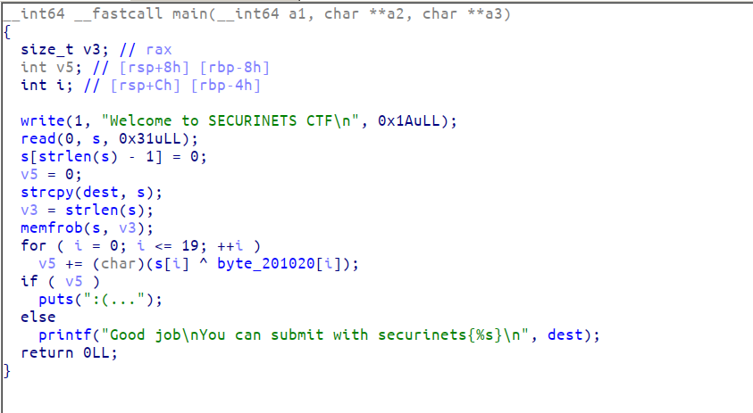

# Warmup : Welcome to securinets CTF (100 pts)

We were given a 64bit stripped binary that asks for input and print ":(..." if it's wrong.


Let's open the binary in IDA and see the decompilation of the main function



So it asks for input then pass that input to memfrob function and last of all it compares the result with a constant string ```byte_201020```.

memfrob function just xor'es a memory area with the byte ```0x2a```. So getting the flag is simple. we just need to xor back the data in that memory location with byte 0x2a.


```python
from pwn import *
xor("\x46\x19\x5E\x0D\x59\x75\x5D\x1E\x58\x47\x75\x1B\x5E\x75\x5F\x5A\x75\x48\x45\x53","\x2a")
```

```FLAG : securinets{l3t's_w4rm_1t_up_boy}```
