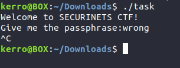
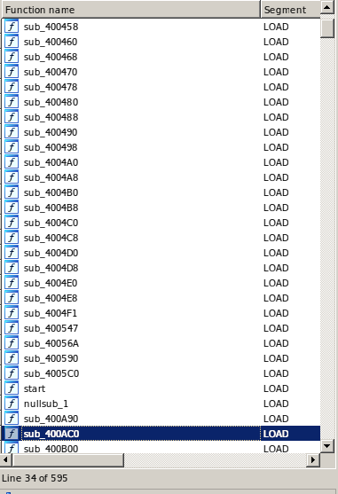
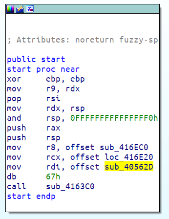
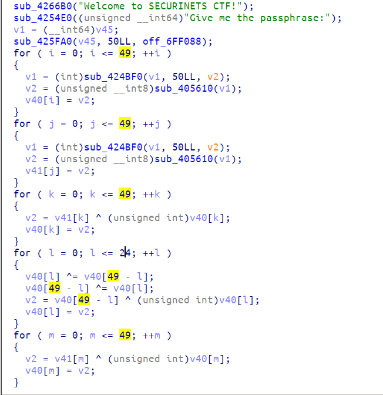
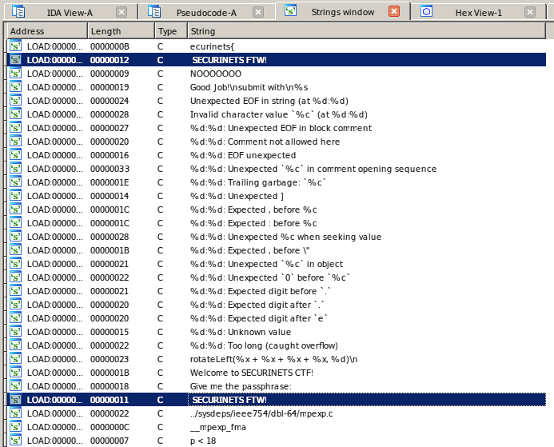
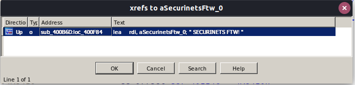
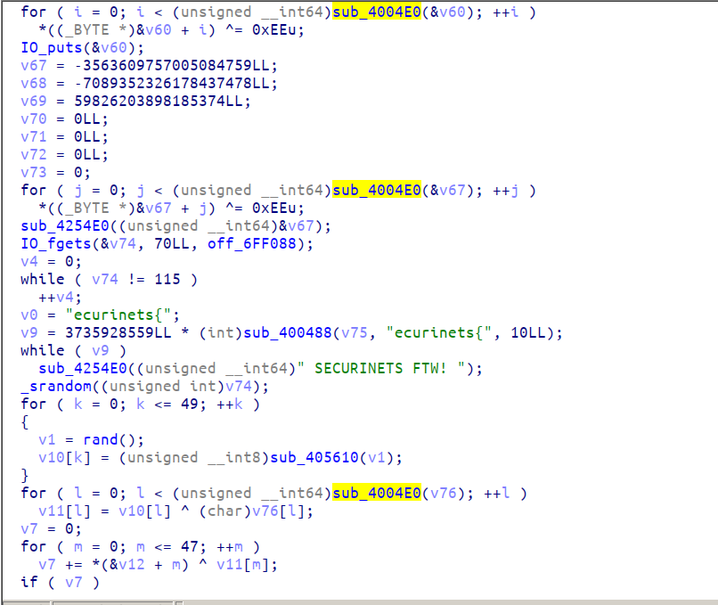
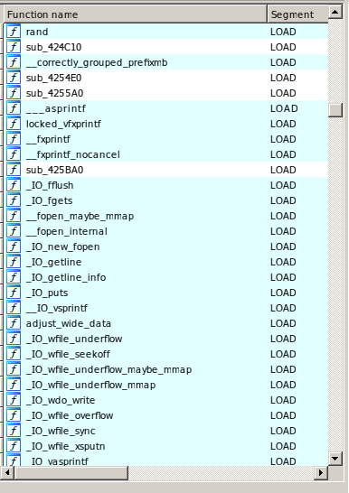
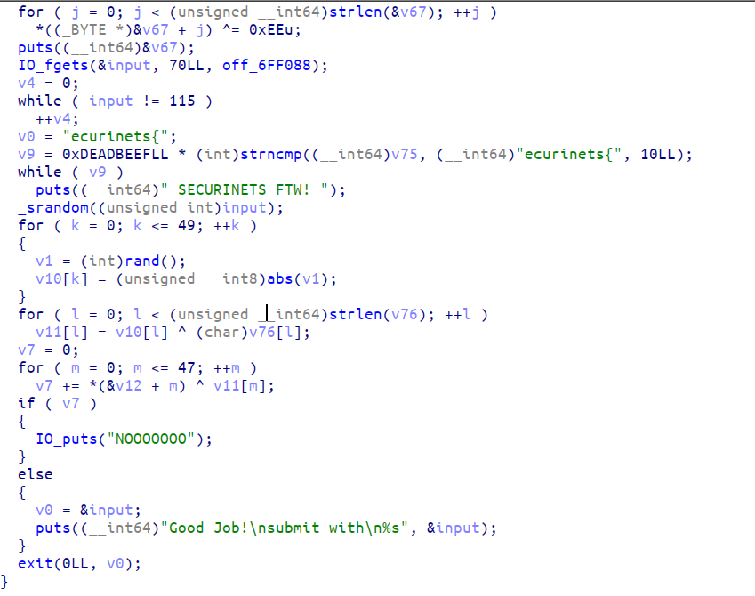
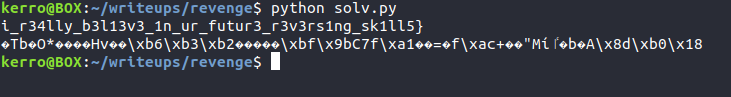

# static EYELESS REVENGE (991 pts)

We were given a 64bit statically linked binary missing sections headers so no dynamic analysis (GDB won't execute it).

When we run it, it asks for a passphrase and then takes alot of time without sending back any response. It's probaby waiting for another input or it's in an infinite loop.



Let's open it in IDA and see what's going on.

It's stripped and statically linked so we won't find the main function also there will be alot of unamed functions.



As you can see more then 500 functions. So to find the main function we need to find the first argument of the call to ```__libc_start_main``` in ```_start``` function.



The marked sub-routine is the address of the main function let's decompile it and see what's going in there.


  
The main is a pretty large function. But long story short when we analyze this function we will figure out that the algorithm is unsolvable ; impossible to break it or to restore the flag from it.

My inteded solution is to use the ```xref``` feature to determine the right function being executed. And that's why i messed up the sections headers to not let the constant just put the binary in a debugger and get the right function address easily.

Okay let's first open ```strings``` tab in IDA (shift+F12).



As the screenshot shows we will find duplicated strings (the 2 strings selected in the screenshot for example). One is used in the fake function and the other is used in the right function.

To find the right function just double click on one of the strings and press ```x``` key in the keyboard a list will apear with all references where this string is used exactly.



Double click on that sub-routine and press ```tab``` or ```F5``` key to decompile and you'll see the right function being executed before the "fake" main.



As you can see most of the functions are not named because the binary is statically linked and stripped and to understand the correct behaviour behaviour we need to identify the functions so we're using the FLIRT technology of IDA it's a technology that rename the functions based on their signatures. But to do that we need to to get a database of signatures. I used /amd64) github repository i found in google.

To install the database files just clone the repository in ```sig``` directory in the root directory of your installed IDA. And move the files in ```sig-database/ubuntu/libc6/18.04 (bionic)/amd64``` directory of the cloned repository in ```sig/pc``` in the root path of your installed IDA. Then restart IDA.

Ok now the .sig files are installed we need to start using them ; navigate to tab ```File->Load file->FLIRT signature file...``` and a list of all installed .sig files will apear. find the files starting with "libc" word select them and press OK button. repeat that process on all the files starting with "libc" because we don't know the libc version used while compiling this binary so we have to try them all.

After that you will notice that most of the functions in the list are renamed correctly (not all of them tho, you have to rename some of them which used in the function we want to analyze by yourself it's not that hard to identify them ```strlen``` for example used in the 2 loops) . 



And here we go!



1) It gets input from the user then it tests if the first letter is ```s``` (line 154 and 155).
 
2) it tests if the next 10 letters match the string ```ecurinets{``` (from line 157 to 159).
 
3) it seeds the random with the tested first letter of the input so it seeds with 115 ( chr('s') ).
 
4) it generates a random BYTES array.

5) it xor's the string ```input+0xb``` with the generated random BYTE array.

6) compares the result with a another BYTE array (initialized in the beginning of the function)

So all we need to do is to generate the same sequence of bytes and xor back the values. I wrong this C code to generate the bytes.

```C
#include<stdio.h>

int abs(int x){
    if(x<0)
        return -x;
    return x;
}

int main(){
    srand(115);
    for(int i = 0 ; i < 100 ; i++){
        printf("%d,",(abs(rand())) & 0xff);
    }

    return 0 ; 
}
```

It will give back this sequence ```159,196,119,205,2,207,82,234,151,78,129,2,2,79,229,25,155,95,202,80,249,170,34,185,219,178,9,165,220,250,3,123,190,122,72,193,73,155,171,225,233,44,227,235,124,200,5,23,39,207,103,33,121,137,218,84,59,227,250,24,221,253,147,156,119,220,93,193,119,8,162,96,53,133,75,177,78,80,200,117,32,47,150,153,184,113,238,243,84,232,11,50,229,159,206,92,123,43,29,242```. Then we'll use this python script to reverse the xor operation.

```python
from pwn import *

keyBytes = [159,196,119,205,2,207,82,234,151,78,129,2,2,79,229,25,155,95,202,80,249,170,34,185,219,178,9,165,220,250,3,123,190,122,72,193,73,155,171,225,233,44,227,235,124,200,5,23,39,207,103,33,121,137,218,84,59,227,250,24,221,253,147,156,119,220,93,193,119,8,162,96,53,133,75,177,78,80,200,117,32,47,150,153,184,113,238,243,84,232,11,50,229,159,206,92,123,43,29,242]
cipherTextBytes = [246,155,5,254,54,163,62,147,200,44,178,110,51,124,147,42,196,110,164,15,140,216,125,223,174,198,124,215,239,165,113,72,200,73,58,178,120,245,204,190,154,71,210,135,16,253,120,29]

key = ""
cipherText = ""
for i in keyBytes:
    key += chr(i)
for i in cipherTextBytes:
    cipherText += chr(i)
print xor(cipherText,key)
```



And the flag appears.

```FLAG : securinets{i_r34lly_b3l13v3_1n_ur_futur3_r3v3rs1ng_sk1ll5}```


