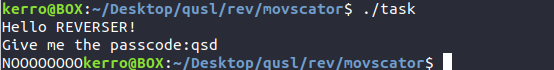
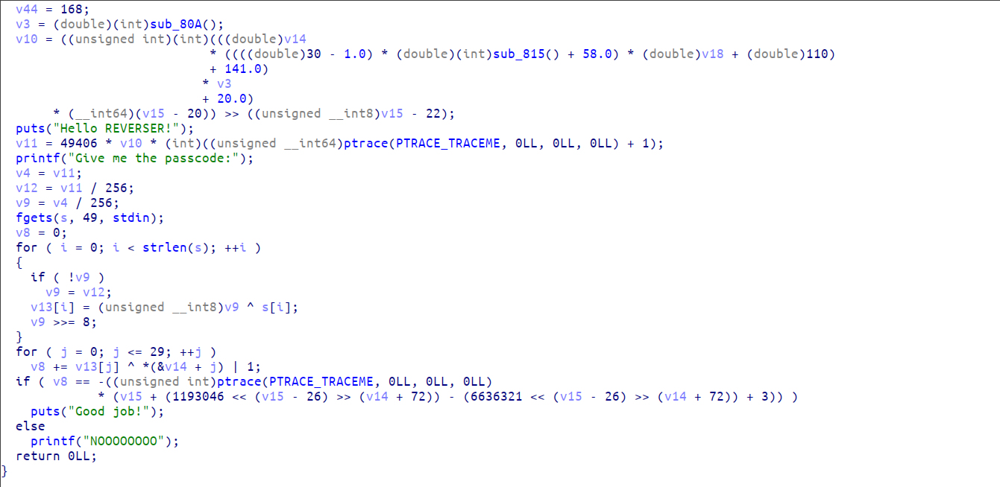
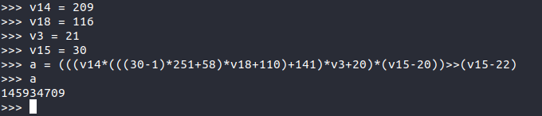

# static EYELESS (834 pts)

We were given a 64bit binary missing section headers so no dynamic analysis.

When we execute it, it asks for a passcode and prints "NOOOO" if it's wrong.



Let's open it in IDA and see the main function.



We see it's initializing a variable with a long obfuscated code, we don't have to reverse that code and know what it does. We will just put it in python (after cleaning it a bit) and get the result.



next it initialize v11 with a call to ptrace. Outside a debuuger ptrace should return 0 as a first call.

so ```v11 = 145934709 * 49406 * 1 = 7210050232854``` 

then it reads the input and performs this encryption algorithm:
```python
v9 = v11/256
v12 = v11/256
for i in range(len(input)):
     if v9 == 0:
             v9 = v12
     v13 += chr(ord(input[i]) ^ (v9 & 0xff))
     v9 = (v9>>8)
```

and then compares the result with the one initialized in the beginning of the main function.

So now we got the right v11 value the only thing left to do is to xor the data back with the same pattern to get the flag. This simple python solver will do the job:

```python
res = [209,30,219,251,116,203,21,221,250,117,217,75,218,232,115,209,79,204,231,54,204,78,231,252,54,193,16,141,175,123,168]
ct = ""
for i in res:
     ct += chr(i)
v9 = 0x68eb87ba216 / 256
v12 = 0x68eb87ba216 / 256
flag = ""
for i in range(len(ct)):
     if v9 == 0:
             v9 = v12
     flag += chr(ord(ctf[i]) ^ (v9 & 0xff))
     v9 = (v9>>8)
print flag
```

```FLAG : securinets{0bfus4ti0n5_r0ck5!}```
