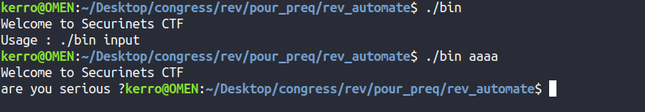
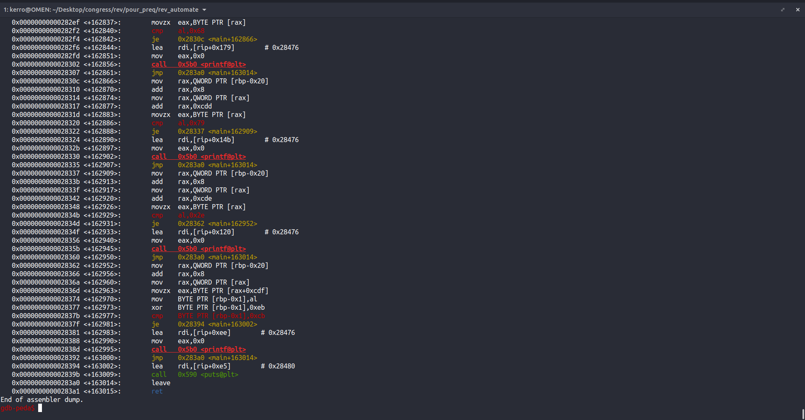
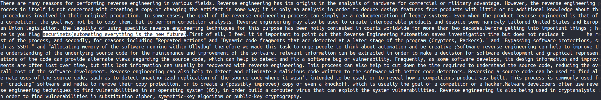

# AutomateMe

Given a not stripped 64 bit binary that requires args annd prints "are you serious?" if it's wrong .

 

 

Opening the binary in gdb and disassembling the main function it looks so long (163015 assembly instructions).

 

 

but we notice that it follows a pattern it does 2 types of verifications : compares the nth character as plain and sometimes it xors it with a byte (0xeb) then compares it.

so we can dump all the assembly in a text file with this command:
`gdb -batch -ex 'file bin' -ex 'set disassembly-flavor intel' -ex 'disassemble main' |tail -n +30 >instructions.txt`

and my friend anis_boss (pwn's author) wrote a python script to dump the right input character by character and follow the xor operations.

after we execute it, it gives that text.

 

 

in which we can see the flag.

FLAG: `securinets{automating_everything_is_the_new_future}`
