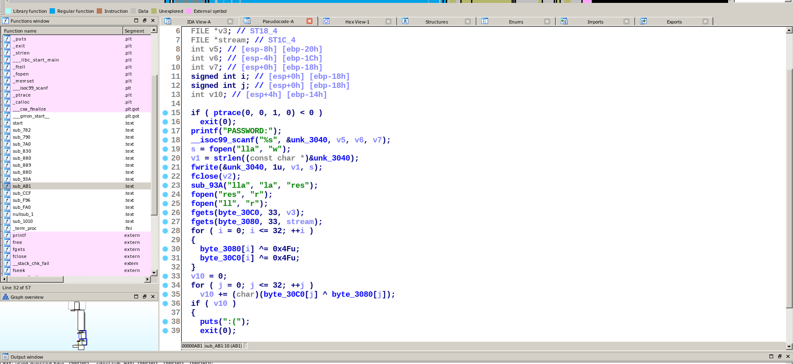
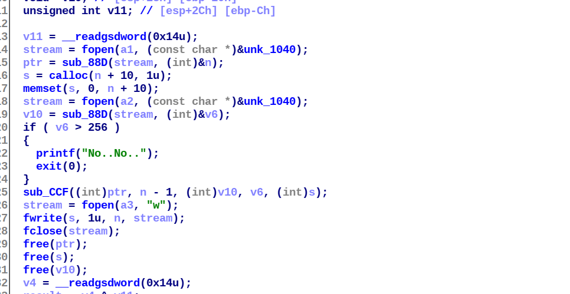
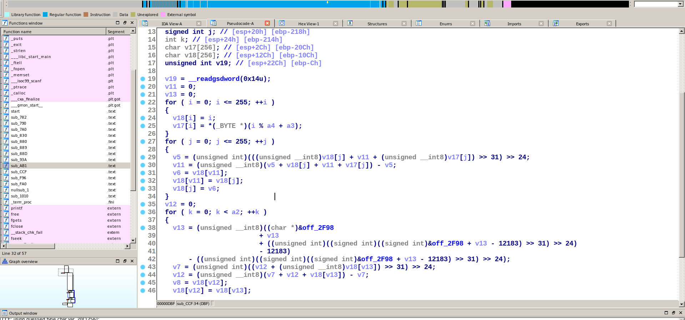
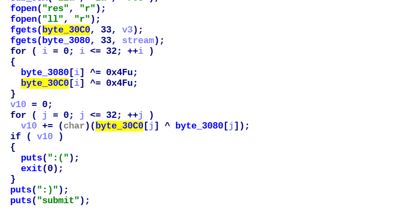
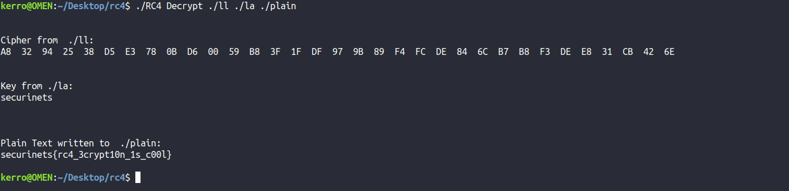

# RBOOM

Given a 32bit stripped binary when we execute it, it asks for a password.

stripped so there is no main function in IDA we have to find it.
it's `sub_AB1` cuz it's the function asking for the password.

 

 

it uses a simple anti-debug technique the call for `ptrace` we can bypass it by modifying the register in gdb or patching the binary in IDA by changing the jump instruction from `jns` to `js`.

after asking for input it stores it in a file called "lla" after that it makes a call to `sub_93A` with args "lla", "la" and "res" : "lla" contains our input "la" contains `securinets` and "res" is empty for now.

 

 

in that function it verifies that the content of file "la" doesn't acceed 256 bytes and then makes a call to `sub_CCF` with our input , "securinets" the content of "la" file and their sizes.

in that function we can recognize the algorithm by looking at the for loops from 0 tp 255 it's RC4 encryption and now we can know that the checked string in `sub_93A` is the key for the encryption cuz RC4's key can't acceed 256 bytes. 

 

 

after that it stored the result of the encryption in "res" file.

now going back to main it's reading the content of "res" and "la" files then xors them with `0x4F` then it compares the results by xoring them and the sum of the operation must be equal to 0 so they are equal.

PS: "ll" file contains the ciphertext of the right input.

 

 

So our goal here is to decrypt the content of the file "ll" with key "securinets"

looking in github found some [C code](https://github.com/kmohamed2020/rc4) to decrypt RC4.
after we use it to decrypt the cipher we get the flag as a plain text.

 

 

FLAG: `securinets{rc4_3crypt10n_1s_c00l}`
