# Vectors

Given a 64 bit stripped binary, it asks for passcode checks it somehow then a result message appears.

 

 

executing strings on it we can figure out it's written with C++ cuz it's using libstdc++ and functions names are similar to C++'s functions.

 

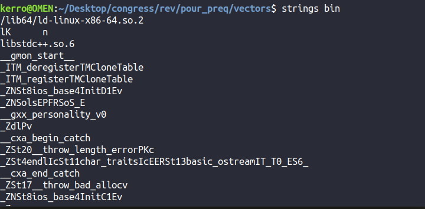

 

let's try to open the binary in IDA starting with main function.

first it asks for hex input with "%lx" format then it calls some functions `sub_EDA`, `sub_F37`, `sub_101B`, `sub_15CE`, `sub_1586`, `sub_16CE` then it doest some checkes with `sub_172A` if it's right it calls `sub_10BD` otherwise it calls `sub_122F`.
ok let's analyzing them one by one. the challenge named vectors so probably it's using vectors in manipulations.
the first function `sub_EDA` just takes every byte of our hex input then initializing a vector with these values. By shifting right by 8 bits and pushing the first byte in the vector by doing "& 0xff" operation.

 

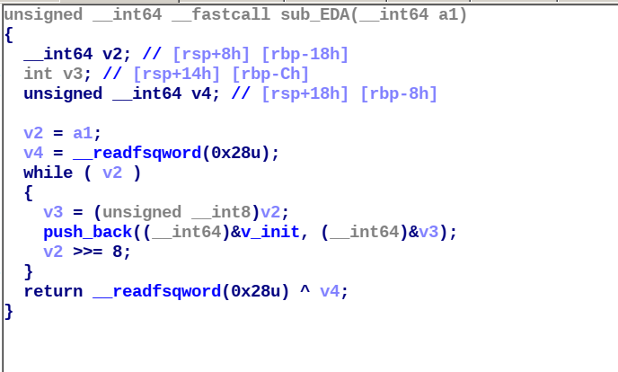

 

let's call it "init1" function and let's call the initilized vector "v_init".

the second function `sub_F37` initialize another vector with some bytes that we can find in the function. let's call this function "init2" and the initilized vector "v1".

 

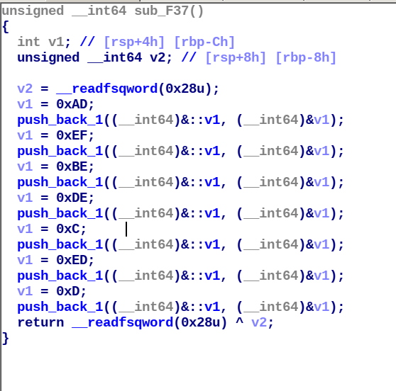

 

I called some functions calls in these functions with their appropriate names like "push_bash" and "push_back1" they're functions just pushing a given value in the given vector.

 

The next function is `sub_101B` it copies the "v_init" in other vector let's call it "v2" and let's call that functon "copy".

 

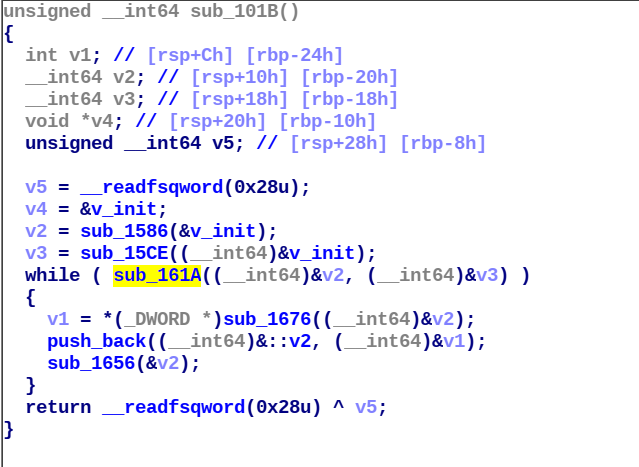

 

the function `sub_15CE` returns an iterator to the end of the vector let's call it "end".

 

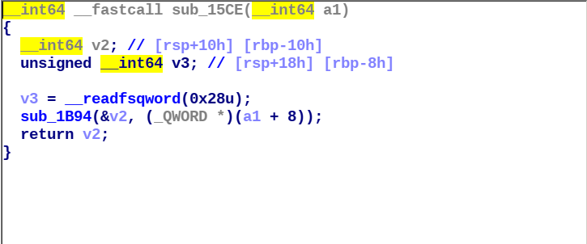

 

the function `sub_1586` returns an iterator to the begin of the vector let's call it "begin".

 

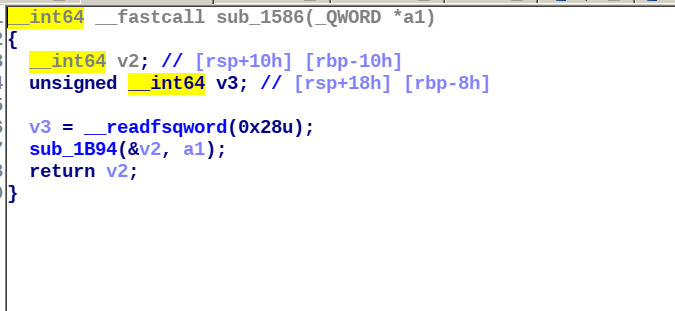

 

the function `sub_16CE` sorts the space between the 2 iterators passed as parameters. it's called 2 times in the code once for the first vector and another time for the second.
let's call it "sort".

 

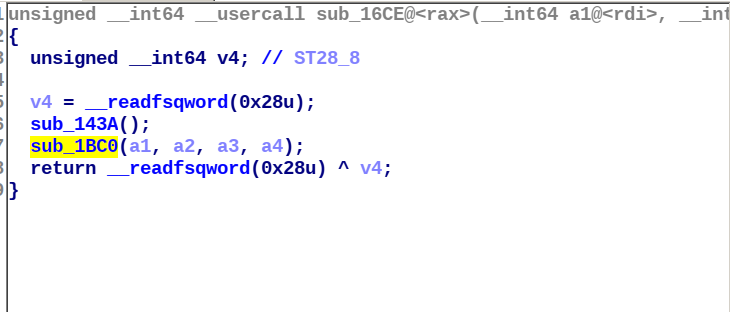

 

the function `sub_172A` is checking if the 2 vectors passed as parameters are equal.
let's call it "is_equal"

 

the function `sub_10BD` is the greating one if the input is right it will jump there so let's call it "right".

 

the last function `sub_122F` contains the string "GET THE F\*CK OUT UR NOT PERMITTED HERE!" so it's the function that our code jumps to if the input is wrong so let's call it "wrong"

 

here is the final pseudo code after renaming all functions it seems more readable and easy to understand.

 

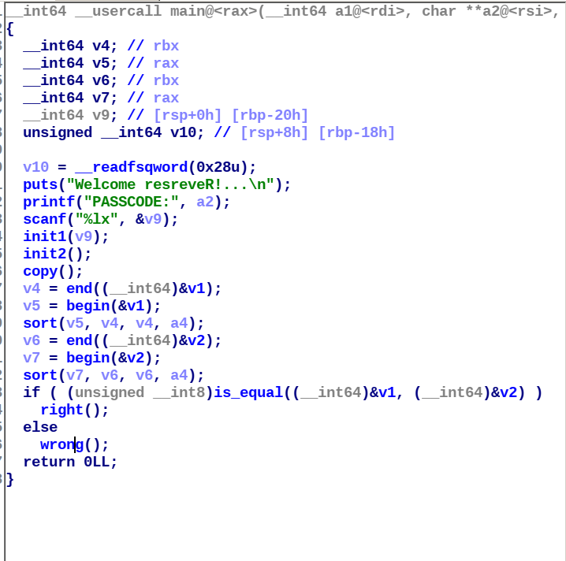

 

So let's recap the flow of executing, the binary takes a hex input initialize a vector with bytes of that input copies it in another vector and initialize a third one with given bytes sorts the 2 vectors compare them and jump to a result function "right" or "wrong".

 

Ok now let's analyze the "right" function to know what it does if our input is true.

 

first it opens the file "test" and reads its content and stock it in a variable called "s". Then xors every byte of this hardcoded string with the bytes of vector "v_init" initialized with bytes of our input. then prints "GOOD JOB U GOT THIS, HERE IS UR FLAG:" with our flag (the result of the xor) so we know that "test" contains our flag xored.

 

but we notice here that it's sorting the 2 vectors after getting the input, so if our input is right (with correct bytes) but not in the right order it will print a "good job" message but the xor will go wrong and the printed flag is unreadable.

so we have to figure out the right order of the bytes `0xad`,`0xef`,`0xbe`,`0xde`,`0x0c`,`0xed` and `0x0d`.

 

as you can see in the image below i gave it the correct bytes but in wrong order a "good job" appeared but a wrong flag!

 

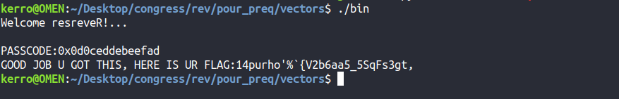

 

To figure out the right order we have 2 methods:
 
1: bruteforce all orders using the algorithm "next_permutation" it gives all possible combinations of list elements.
 
2: xoring back the first 7 bytes of the content of the file "test" with the right flag format cuz we know it starts with "securinets" we'll get the 7 correct bytes in the correct order so we have to collect them one by one
 

I'll use the 2nd method cuz it takes less time and more tricky.

 

as you can see here we got the right order of the bytes.

 

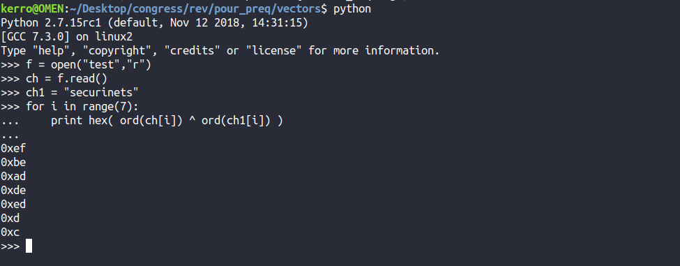

 

all we have to do is the collect them in the reverse order cuz we know the operation if initialization of vector "v_init" is done by "& 0xff" so it starts with the least significant bytes.

 

after doing this we get this hex number `0x0c0deddeadbeef` .

we give it to the binary and the flag is clear here.

 

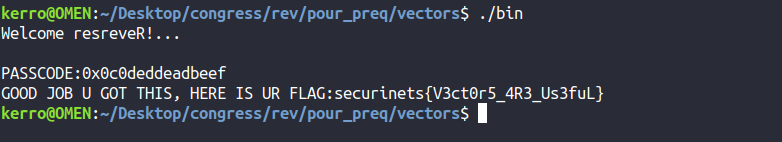

 

FLAG: `securinets{V3ct0r5_4R3_Us3fuL}` .

