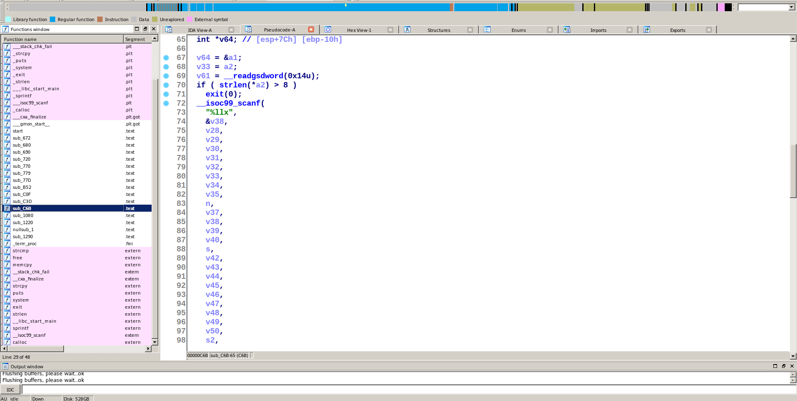

# MONSTER

Given a 32 bit stripped binary. without printing any input asking for input checking and printing "JUST GET OUT" cuz we're giving wrong one.


Opening the binary on IDA there is no main function so we have to figure out which one it is as we can see sub_C6B is asking for input so it is the main function.

<br>



<br>

it's asking for hex input with the format string "%llx"

but before all of this we notice that check if the pointer on a2 variage which is the argv is longer than 8 the binary just exits. 
it's a simple tricky anti-debug technique cuz if the binary is executed outside debugger argv[0]  will contain the environmemnt executing (binary name) only but if we're in a debugger we'll get full path of the binary in that variable which is longer than 8 bytes so it's in a debugger and it will just exit.


then we see that `sub_B52` function taking a string and 2 given bytes in the input as argument.

the string: `tsebehtsignisrever`

it xors every byte of the string with the lowbyte of the integer passed as 2nd parameter then it multipies the integer * 1337 and that function `sub_1080` just do modulo operation like if we consder n=0xaabb our input in every iteration it does `n = ((n * 1337) % 133713371337)`.

<br>


<br>


then it passes the result of the xor operations to the function `sub_77D` which is MD5 function in C we can recognize it with the initializations of the variables with hex values ur just we can make a breakpoint with gdb and see the result of calculations.


<br>


<br>

then take a pre-initialized string in the .DATA section of the binary which is located in 0x3020 offset 

<br>


<br>

and calculate its MD5 hash then comparing the 2 hashes if they're equal it jumps to `sub_C0F` which contains a system call to print the flag


<br>


<br>


otherwise it jumps to `sub_C3D` the function printing "JUST GET OUT".


<br>


<br>


So we know that the second hash it the right one so we have to find an input that after these all calculations it gives  that one.
We can extract that hash using gdb just making a breakpoint in strcmp (don't forget to bypass the anti-debugging technique by modifying the register before the cmp instruction).

<br>


<br>

so we know the correct hash is `0d64ecdb3defc7d75003884274e9906b`.
the idea here is to bruteforce the input that gives as that hash so i wrote that simple python script doing the job.
```python
import hashlib
correct_hash = "0d64ecdb3defc7d75003884274e9906b"
ch = "tsebehtsignisrever"
for j in range(0xffff):
	ch1 = ""
	b = j
	for i in ch:
		ch1 += chr(ord(i) ^ (b & 0xff))
		b = ((b * 1337) % 133713371337)
		if hashlib.md5(ch1).hexdigest() == correct_hash:
			print hex(j)
			exit(0)
```
this script gives us `0xfebe`. trying it as input and the flag appears.

<br>


<br>

FLAG: `securinets{mD5_EncOd1nG_iS_Be4uT1fuL}`