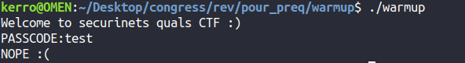
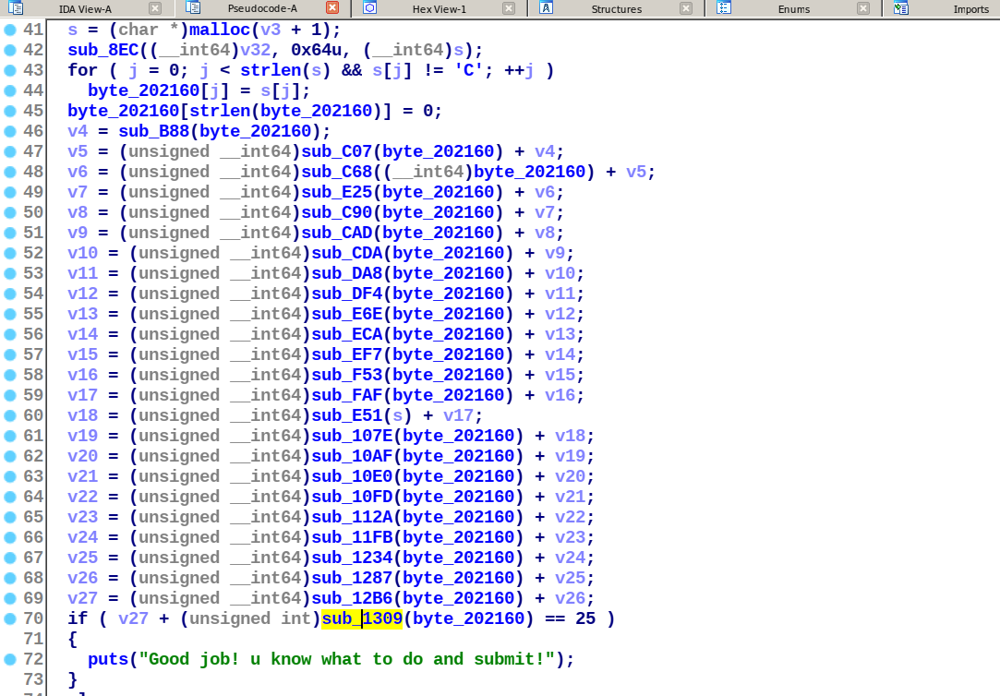
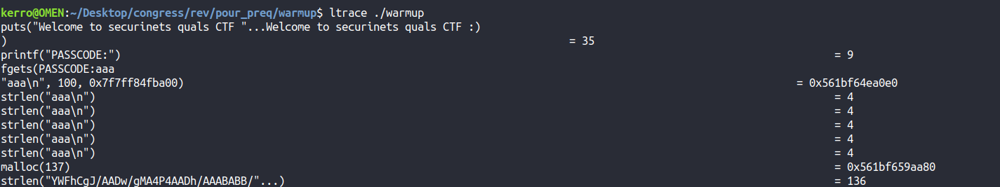
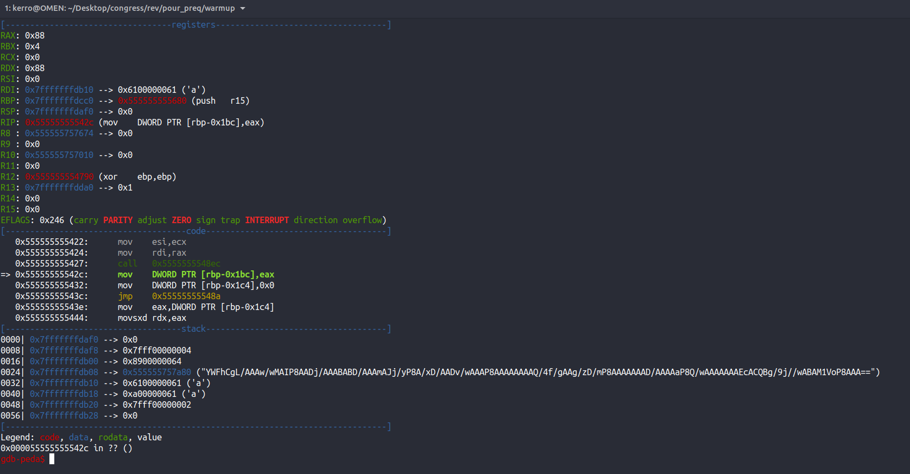

# Warmup challenge (RE)
Given a stripped 64 bit binary.
executing it, asking for a passcode then somehow it will get checked and a result message appears on the terminal.
 

 
After opening the binary in IDA and entering decompilation mode it does some encodings on the input and it checks the result by doing some calculations on the characters.
 

 
so first of all we have to identify the encoding algorithm.
We can use 2 methods to do that ltrace or setting breakpoints on a debugger and check the output of the encoding function maybe we can identify it by format.
## ltrace:

 

 

## using a debugger (GDB in our case):

 

 
So as we can see the algorithm is base64 encoding u can try and input some known input it will encode it to base64.

After identifying the algorithm we'll try to dig more in the binary and follow the calculations done by functions and write a python script just following the instructions one by one contructing the encoded string that goes well with the conditions then decode it getting the flag.

FLAG: `securinets{l3ts_w4rm_1t_up}`
