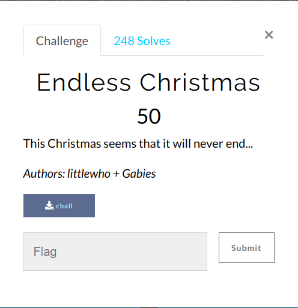
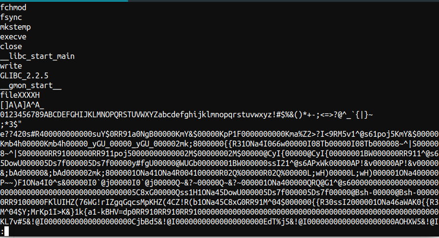
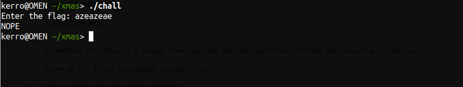
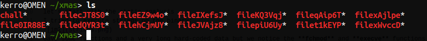
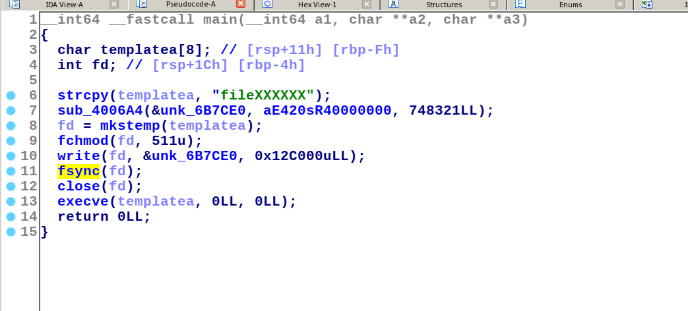
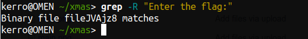
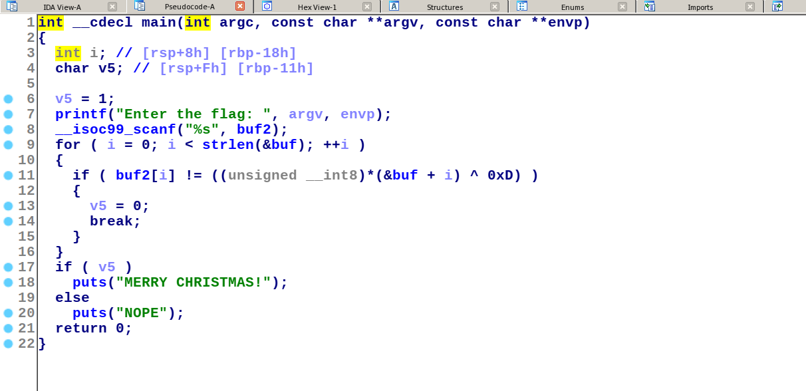

# ENDLESS CHRISTMAS




so endless christmas is a simple reversing task with multiple file creating and executing procedures.

given an ELF 64-bit executable stripped file.

let's start with the static analysis
I tried to execute strings on the binary:

Gave some functions and a very long hard-coded data but we notice the **fchmod** and **execve** functions

so maybe the binary is creating some other files and give them permissions and execute them?!

ok lets execute this now to figure out:



It asks for a passphrase (flag) to verify but I noticed that the file is taking 1 or 2 seconds to execute for some reasons :/

I tried **ls** on my terminal 




it seems like our first-view guessing is true it created other files but we don't know if all of them are executed or not?


let's fire-up IDA maybe we can decompile it to know what's going on, the decompilation of the main function:




so it's creating a file, do some calculations on the hardcoded data `aE420sR40000000` and stores the result in `unk_6B7CE0` 
then makes a temporary file with `mkstemp()`, gives the perimission with `fchmod()` writes the result data in that file synchronise to write data on the hard-disk with `fsync()` and executes the file without arguments.

it generates multiple files so the executed file will do the same thing until it reaches the last file which is asking for the flag, but which one of them ? 

so my idea was to execute recursive grep to determine which file contains `"Enter the flag:"` string and it worked!



let's try to open that file with IDA 

the main function looked like this




it's a simple xor function compares the input to some other byte xored byt **0xD**.
so i dumped the `buf` variable content with the IDA hexView

and wrote a very simple solver:
```python
arr=[0x55,0x20,0x40,0x4C,0x5E,0x76,0x69,0x3E,0x6E,0x3D,0x69,0x3E,0x52,0x39,
	 0x3B,0x39,0x3C,0x63,0x52,0x39,0x63,0x69,0x52,0x39,0x3B,0x39,0x3C,0x63,
	 0x52,0x39,0x63,0x69,0x52,0x39,0x3B,0x39,0x3C,0x63,0x52,0x39,0x63,0x69,
	 0x52,0x39,0x3B,0x39,0x3C,0x63,0x52,0x39,0x63,0x69,0x52,0x6B,0x61,0x39,0x3B,0x70]
print ''.join(chr(arr[i]^0xd) for i in range(len(arr)) )
```

flag:`X-MAS{d3c0d3_4641n_4nd_4641n_4nd_4641n_4nd_4641n_4nd_fl46}`

